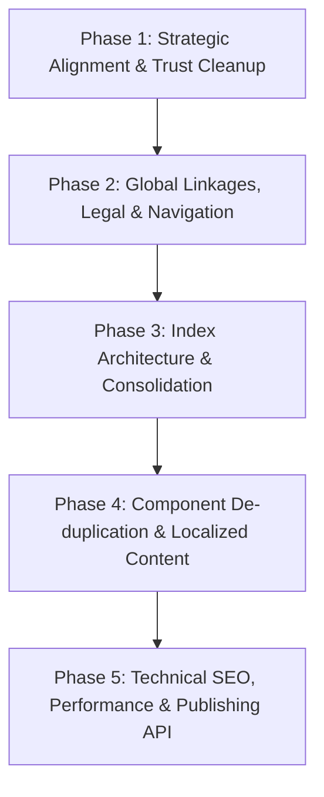

# Heapvue.com: Complete Structural Audit & Implementation Plan

> **Source:** Rothenhall Partners Audit Report (Phase 1 Review, Dated 9 October 2026)  
> **Repository:** `Heapvue/heapvue.github.io` (Next.js 14 App Router)  
> **Scope:** Site map, page hierarchy, routing, component refactoring, trust/proof cleanup, and technical infrastructure. (Copy rewrites and brand photography are deferred to Phase 2).

---

## 1. Executive Summary & Strategic Premise

The Rothenhall Partners audit identified that Heapvue currently presents four divergent identities across its digital properties:
1. **Homepage:** Pitches AI revenue intelligence for modern GTM and sales teams.
2. **Footer:** Advertises premium IT solutions, cloud architecture, and AI integrations.
3. **Consulting Pages:** Pitches enterprise strategy, digital transformation, and compliance.
4. **Products Page:** Lists five disparate proprietary products without clear relation to services.

Furthermore, the site suffers from structural fragmentation, ghost routes returning **404 errors** (`/privacy`, `/terms`, `/services`), template duplication, unverified trust claims, placeholder assets, and a critical LCP speed bottleneck (21,660 ms).

This document details **every single change** mandated by the audit report without omission, cross-referenced with the active codebase, and provides an actionable implementation plan.

---

## 2. Decision Required First: Heapvue Positioning Model

Before executing page restructuring, a fundamental strategic choice must be locked in:

| Model | Current State | Proposed Structure | Recommendation & Impact |
| :--- | :--- | :--- | :--- |
| **Option A: Product Company** | Home sells revenue intelligence. | Home leads with flagship product (HeapSync / ChatPress / Revenue AI). Solutions, consulting, and industries become secondary under `/services`. | Best if Heapvue's primary enterprise value is recurring software licenses (SaaS). |
| **Option B: Services Company** | Solutions, consulting, and industries describe custom software development. | Home leads with engineering capabilities and what Heapvue builds. Products sit as a secondary showcase of proprietary accelerators/frameworks. | Best if Heapvue's revenue is driven by custom engineering, cloud delivery, and client retainers. |
| **Option C: Hybrid (Both)** *(Recommended)* | Mixed messaging across pages. | **Two distinct lanes from the hero:** "Products" (off-the-shelf software) and "Services" (custom engineering & consulting), each with its own index, FAQ, and CTA. Every industry sector receives a clear **"Built On"** strip explicitly stating *Buy, Build, or Customise*. | **Preserves all existing investments**, removes user confusion, and directly resolves the overlap between products and custom services. |

---

## 3. Comprehensive Master Change Matrix

### 3.1. Target Site Map & URL Restructuring (Section 3)

| Route / Page | Planned Action | Merge Into It | Deletions, Redirects & Fixes |
| :--- | :--- | :--- | :--- |
| **`/` (Home)** | **Keep** | No merges. | • Delete testimonials carousel (unverified quotes, mentions competitor "Runlayer").<br>• Delete placeholder logo strip ("umbrella", "cactus", "flash").<br>• Remove unsourced rating badge ("4.97/5 from 500+ reviews") and stock avatars. |
| **`/solutions`** | **Rebuild as True Index** | The 6 solutions become dedicated feature sections or clean child pages linked from the index. | • Delete duplicate project stories and shared images (`sol4.png`).<br>• Replace current behavior (which renders `platform-development` directly) with a true comprehensive solutions directory. |
| **`/consulting`** | **Consolidate to Single Page** | The 4 consulting practices become dedicated anchor sections on `/consulting`. | • Keep child URLs (`/consulting/digital-transformation`, etc.) as anchor redirects or child pages.<br>• Remove repeated offers and identical proof cases.<br>• Replace current behavior (which renders `digital-transformation` directly) with a unified consulting practice overview. |
| **`/industries`** | **Consolidate to Single Page** | The 5 industry verticals become anchored sections on a single page. | • Delete boilerplate clone sections across pages.<br>• Drop "Startups" as an industry vertical (reclassify MVP services into engagement models).<br>• Split back into individual URLs only when each vertical has verified client logos and proof. |
| **`/products`** | **Keep** | No merges. | • Delete dev host link (`dev.learnly.heapvue.com`) and point to production domain.<br>• Remove unverified "Enterprise ready" badges.<br>• Add real product cards with screenshot, interactive demo link, docs link, pricing/trial model, and pilot customer profile. |
| **`/about`** | **Keep & Expand** | Merge the general **Careers pitch** into `/about`. | • Delete platitude blocks lacking factual substance.<br>• Add founders section, founding year, headcount band, team photo, physical HQ address, and company milestone timeline. |
| **`/careers`** | **Conditional Keep** | Keep only if active, concrete open positions exist with job specs. | • Delete the 6 placeholder cards with no specs that merely redirect to `/contact`.<br>• If no active hiring, display an authentic "No open roles currently - send open CV to careers@heapvue.com" block. |
| **`/contact`** | **Keep & Unify** | All site-wide Demo, Appointment, and Consultation CTAs point here. | • Delete the static calendar image (`calender.png`).<br>• Delete the off-topic outreach FAQ.<br>• Clean up garbled address, add operating hours, Google Map link, and explicit response SLA. |
| **`/privacy`** | **Create New Page** | N/A (Currently returns 404). | • Publish standard legal privacy policy.<br>• Link from footer and contact form consent checkbox. |
| **`/terms`** | **Create New Page** | N/A (Currently returns 404). | • Publish standard terms of service.<br>• Link from footer and contact form. |
| **`/services`** | **Redirect Route** | Redirect to `/solutions`. | • Implement a permanent 301 redirect in Next.js config from `/services` to `/solutions`. |

---

### 3.2. Global Component & Site-Wide Fixes (Section 4)

1. **H1 Tag Optimization:**
   - **Current:** Home has no `<h1>` tag; the main headline is hardcoded inside an image (`the heading home.png`), while the top capsule badge acts as a pseudo-headline.
   - **Fix:** Remove `the heading home.png`. Render the primary headline as semantic HTML `<h1>` with responsive CSS typography. Guarantee exactly one `<h1>` per page across the entire site.
2. **Footer Legal Links:**
   - **Current:** Links to `/privacy` and `/terms` lead to 404 error pages.
   - **Fix:** Build and route `/privacy` and `/terms`. Wire them into the footer copyright bar and the contact form consent note.
3. **Broken Link Remediation:**
   - **Current:** "Explore Our Services" button in `ServicesSection.js` points to `/services`, which returns 404.
   - **Fix:** Change link to `/solutions`, and configure `next.config.mjs` redirect `source: '/services'` -> `destination: '/solutions'`.
4. **Navigation & Footer Terminology Unification:**
   - **Current:** Main navigation reads "Product" (singular), whereas footer reads "Products" (plural).
   - **Fix:** Standardize on "Products" in both `Navbar.js` and `Footer.js`.
5. **CTA Architecture & Calendar:**
   - **Current:** "Book a Demo" simply triggers an email alert popup; "Book an Appointment" opens `/contact`; calendar graphic (`calender.png`) is a non-interactive image.
   - **Fix:** Unify all appointment and demo buttons to route directly to `/contact`. Replace static calendar graphic with either a real scheduling embed (e.g. Cal.com / Calendly) or a clean contact/booking card with response SLA.
6. **Project Card CTA Relabeling:**
   - **Current:** 18 project cards across solutions display a "View Project" button that simply navigates to `/contact` without showing any case study details.
   - **Fix:** Relabel card CTA to `"Discuss similar project"` or `"Enquire about this solution"`, or build individual case study modals/pages.
7. **FAQ Architecture Overhaul:**
   - **Current:** A single shared `FaqSection.js` containing cold-email outreach / LinkedIn bot questions is rendered on service, consulting, about, and contact pages. Unanswered items exist.
   - **Fix:** FAQ must be a localized, per-page data property. Service/consulting pages must not contain cold outreach or LinkedIn scraping questions. Unanswered questions must be purged.
8. **Mid-Page Banner Removal:**
   - **Current:** The banner `"Discover How To Map Heapvue to Your Stack"` (`MapStackSection.js`) is injected indiscriminately across solutions where it does not fit.
   - **Fix:** Remove `MapStackSection` from solutions pages. Replace with a single, relevant contextual CTA block per page.
9. **Asset & Image Hygiene:**
   - **Current:** 18 solution cards reuse the identical file `sol4.png`. `con3.png` repeats up to 9 times. `con7.png` repeats 5 times per page. Image alt tags repeat identical copy.
   - **Fix:** Each card must have its own distinct image or icon slot. No image file may appear multiple times on a single page. Alt text must uniquely describe the visual content.
10. **Client Logo Strips:**
    - **Current:** Text and emoji placeholders (`umbrella`, `Network`, `Flash`, `Cactus`, `visic`) looped repeatedly without company URLs.
    - **Fix:** Display only real, verified client logos with outbound links. If client permissions are not yet secured, remove the placeholder logo strip entirely.

---

### 3.3. Homepage Refactoring (Section 5)

1. **Hero Section:**
   - Remove the unverified review badge (`Rated 4.97/5 from 500+ reviews`).
   - Remove stock Unsplash avatars (`photo-1534528741775...`). Only re-introduce if backed by verified third-party review platforms (G2, Capterra, Clutch) with exact review counts and clickable links.
   - Replace image headline (`the heading home.png`) with live semantic text in `<h1>`.
2. **Testimonials Carousel:**
   - Remove `TestimonialsSection.js` entirely.
   - Current testimonials contain unverified quotes attributed to large enterprises (Runlayer, Gusto, AngelList, Vercel, Datadog), and the Gusto quote mistakenly praises a different company ("Runlayer is solving this...").
   - Restore testimonials only in Phase 2 when verified client quotes with explicit written consent are available.
3. **Results & Metrics Claims:**
   - Claims such as "Closed 40% more enterprise deals" lack baselines, measurement timeframes, and case study links.
   - Remove unsubstantiated statistics until accompanied by verifiable case study references.
4. **Enterprise Integrations Grid (`IntegrationsSection.js`):**
   - Eliminate disconnected icons and stray SVG formatting.
   - Render clean, individual integration items (e.g. Microsoft Sentinel, Datadog, Splunk, Elastic, Okta), each with an accessible link to integration docs or capability notes.
5. **Case Study Banner (`CaseStudySection.js`):**
   - Replace the static PNG `bonacci.png` (which contains an unclickable "Read Full Story" button flattened into the graphic) with a live HTML/CSS layout containing a real interactive button.

---

### 3.4. Solutions Refactoring (Section 6)

1. **True `/solutions` Index Page:**
   - Today `/solutions/page.js` simply re-exports `PlatformDevelopmentPage`.
   - Build a true index page presenting Heapvue's six core engineering solutions:
     1. Platform Development
     2. Legacy System Modernisation
     3. AI & Intelligent Automation
     4. E-commerce & Digital Experience
     5. Mobile Applications
     6. System Integration & Security
2. **Eyebrow & Card Alignment in Platform Development:**
   - In `PlatformDevApproachSection.js` and `PlatformDevProjectsSection.js`, the eyebrow states `"How We Enable Healthcare"` while the cards showcase finance CRM, EdTech student enrollment, and retail inventory.
   - Update eyebrow and copy to accurately reflect multi-industry platform engineering, or align cards with healthcare.
3. **Deduplication of Case Stories:**
   - **FMCG Migration Story:** Duplicated across E-commerce (`EcommerceProjectsSection.js`) and Legacy Modernisation (`LegacyProjectsSection.js`).
     - *Fix:* Maintain one canonical story on E-commerce; cross-link from Legacy Modernisation.
   - **Healthcare Security Story:** Duplicated across Legacy Modernisation (`LegacyProjectsSection.js`) and Integration & Security (`IntegrationProjectsSection.js`).
     - *Fix:* Maintain one canonical story on Integration & Security; cross-link from Legacy Modernisation.
   - **Voice-to-Text Application:** Duplicated across AI Automation (`AiProjectsSection.js`) and Mobile Apps (`MobileProjectsSection.js`).
     - *Fix:* Keep implementation details on Mobile Applications; maintain AI model engineering focus on AI Automation, with cross-links.
4. **Misfiled Case Studies:**
   - The dental and maxillofacial clinic website currently sits under E-commerce.
   - *Fix:* Rename section to "Web & E-commerce" or move to general platform engineering.
5. **Card Visuals & CTAs:**
   - Replace identical `sol4.png` instances with distinct screenshots or relevant illustrations.
   - Change button text from "View Project" (which sends users to contact) to "Discuss similar project".
6. **Localized FAQs:**
   - Replace default sales prospecting FAQ with technical solutions FAQs tailored to each practice area.

---

### 3.5. Consulting Refactoring (Section 7)

1. **True `/consulting` Index Page:**
   - Today `/consulting/page.js` merely renders `DigitalTransformationPage`.
   - Build an index page outlining the 4 consulting practices:
     1. Digital Transformation
     2. Technology Consulting
     3. Data & Compliance (DPDP, GDPR, HIPAA)
     4. AI Consulting
   - Support child routes or direct anchors.
2. **Eliminate Practice Scope Overlaps:**
   - **Digital Transformation vs. Technology Consulting:** Currently both list architecture advisory, legacy assessment, MVP builds, and product strategy.
     - *Resolution:* Move organizational roadmaps, change management, and business outcomes to **Digital Transformation**; assign stack evaluation, cloud architecture, and technical audits to **Technology Consulting**.
   - **AI Consulting vs. AI Solutions:** Both discuss RAG chatbots and automation, citing identical case studies.
     - *Resolution:* Build & engineering deliverables belong in **Solutions**; readiness assessment, ethics, security governance, and AI roadmapping belong in **Consulting**. Cross-link between the two.
   - **Security Overlap:** Security audits appear in Technology Consulting and System Integration & Security.
     - *Resolution:* Consolidate all compliance and security audit frameworks into the dedicated **Data & Compliance** practice.
3. **Proof Blocks & Repetitive Graphics:**
   - Eliminate duplicated proof stories across consulting pages. Enforce strict rule: **one proof case per practice page**.
   - Stop repeating `con3.png` (7-9 times) and `con7.png` (5 times). Use distinct Feather icons or clean typography.

---

### 3.6. Industries Refactoring (Section 8)

1. **Consolidation into a Single Industries Overview:**
   - Five subpages (Healthcare, Retail & E-commerce, Finance, Education, Startups) currently share identical template structures, identity stacks, and footers.
   - Consolidate into a unified `/industries` page with clear anchored sections for each domain until verified client logos and case proof warrant separate sub-URLs.
2. **Reclassify "Startups":**
   - Startups is a company stage/size, not an industry sector. Its HealthTech card duplicates the Healthcare vertical.
   - Move startup/MVP offerings into an **Engagement Models** or **Solutions for Fast-Growth Ventures** section.
3. **Sector Imagery:**
   - Remove repeating images (`indus1` through `indus11`). Ensure zero duplicate imagery across the page.
4. **"Built On" Product vs. Custom Build Strips:**
   - Resolve the conflict where industry verticals pitch custom software that directly clashes with off-the-shelf products (Finance custom CRM vs. HeapSync CRM; Education custom LMS vs. Learnly LMS; Retail custom e-commerce vs. VueCart):
   - Add a explicit **"Built On" strip** for each sector detailing:
     - **Buy:** Off-the-shelf product license (e.g. HeapSync, VueCart).
     - **Build:** 100% bespoke software engineered from scratch.
     - **Customise:** Hybrid deployment extending the proprietary product core.

---

### 3.7. Core Pages Refactoring: About, Products, Careers, Contact (Section 9)

#### A. `/about`
- Inject real operational facts:
  - Founding year and origin.
  - Leadership / founders section with names and roles (re-enable and refine `OurFoundersSection`).
  - Headcount range.
  - Team photography (or verified cultural imagery).
  - Physical corporate address (Kochi / Ernakulam HQ).
  - Corporate milestone timeline.
- Eliminate unsubstantiated platitude cards.
- Integrate the general careers pitch into About.

#### B. `/products`
- Update product catalog (VueCart, HeapSync, ChatPress, AppTuner, Learnly):
  - Replace dev URL `https://dev.learnly.heapvue.com/` with production host.
  - Remove unsupported "Enterprise ready" claims.
  - Enrich each product card with:
    1. Realistic product UI screenshot/preview.
    2. Interactive Demo or Sandbox link.
    3. Documentation link.
    4. Transparent pricing / trial model.
    5. Representative pilot customer profile or target use case.

#### C. `/careers`
- Eliminate the 6 vague role cards that simply route users to the sales contact form.
- If real vacancies are active, publish complete job specifications with responsibilities, qualifications, and an application mailto (`careers@heapvue.com`).
- If no active roles are open, display an honest "No open roles currently" notice inviting spontaneous applications.

#### D. `/contact`
- **Consent Checkbox:** Add explicit hyperlink to `/privacy`.
- **Contact Details:** Clean up physical address formatting; embed Google Map link; add business working hours (e.g. 9:00 AM – 6:00 PM IST) and a clear reply-time guarantee ("We respond within 24 business hours").
- **Form Fields Standardisation:** Replace ambiguous inputs with:
  - Full Name (required)
  - Work Email (required)
  - Company / Organization
  - Service Required (dropdown matching actual offerings: Platform Development, Legacy Modernisation, AI Solutions, Cloud, Consulting, etc.)
  - Project Budget Range
  - Estimated Timeline
  - Message / Project Brief
- Remove static calendar graphic (`calender.png`) and off-topic FAQ.

---

### 3.8. Technical Infrastructure, SEO & Performance Setup (Section 10)

1. **`robots.txt` Creation (`public/robots.txt`):**
   - Provide standard crawling directives.
   - Explicitly permit reputable AI search engines and crawlers (GPTBot, ClaudeBot, PerplexityBot, Applebot, Google-Extended).
   - Reference XML Sitemap: `Sitemap: https://heapvue.com/sitemap.xml`.
2. **`sitemap.xml` Generation (`src/app/sitemap.js` or `public/sitemap.xml`):**
   - Build a comprehensive XML sitemap encompassing all primary canonical routes (`/`, `/solutions`, `/consulting`, `/industries`, `/products`, `/about`, `/careers`, `/contact`, `/blog`, `/privacy`, `/terms`).
3. **Structured Data (Schema.org / JSON-LD):**
   - **Organization Schema:** Name (`Heapvue`), URL, official logo, corporate description, contact point, and verified social media links (`sameAs`).
   - **FAQPage Schema:** Injected dynamically into every page bearing a localized FAQ component.
   - **BreadcrumbList Schema:** On all sub-pages.
4. **Performance & Core Web Vitals (LCP Optimization):**
   - The audit reported LCP at **21,660 ms** (far exceeding the 2,500 ms threshold).
   - Causes: Uncompressed PNGs (`bonacci.png`, `technologyservices.png`, `up.png`, `down.png`), lack of modern WebP/AVIF formats, oversized hero assets, unnecessary client-side rendering.
   - Fixes:
     - Convert all key banners to optimized WebP/SVG.
     - Leverage `next/image` with explicit width/height, priority tags only on above-the-fold assets, and responsive `sizes` attributes.
     - Remove unused client-side JS dependencies and reduce unnecessary `'use client'` directives.
5. **AI Agent Readiness (Score 61 -> 70+):**
   - Ensure pages render complete semantic HTML from the server without requiring client JavaScript execution.
   - Eliminate all 404 links.
   - Provide clean semantic tags (`<main>`, `<article>`, `<section>`, `<nav>`, `<h1>`-`<h6>`).

---

### 3.9. Blog Publishing API Specification (Section 11)

To fulfill Rothenhall Partners' request for programmatic blog publishing:

- **Hosting & Technology Stack:**
  - Heapvue is built on Next.js 14 App Router.
  - The repository currently utilizes `gray-matter` and `next-mdx-remote`, supporting both file-based Markdown/MDX publishing and dynamic API endpoints.
- **Publishing Architecture Options:**
  1. **Option 1 (Automated API Route - Recommended):** A protected Next.js Route Handler at `/api/v1/posts` secured via Bearer Token (`Authorization: Bearer <BLOG_API_SECRET>`).
  2. **Option 2 (Git-Backed CI/CD):** Direct Markdown commit to `content/blog/` triggering automated Vercel/GitHub Actions deployment.
  3. **Option 3 (Headless CMS Integration):** Webhook-driven integration with Contentful, Sanity, or Strapi.
- **Accepted API Post Schema:**
  ```json
  {
    "title": "Scaling Cloud Architecture with Zero-Trust Security",
    "slug": "scaling-cloud-architecture-zero-trust",
    "excerpt": "A deep dive into multi-cloud resilience and identity-driven access.",
    "author": {
      "name": "Heapvue Engineering",
      "avatar": "/images/authors/heapvue.png"
    },
    "publishedAt": "2026-10-10T12:00:00Z",
    "tags": ["Cloud", "Security", "Architecture"],
    "coverImage": {
      "url": "https://heapvue.com/images/blog/zero-trust.webp",
      "alt": "Cloud Architecture Diagram"
    },
    "content": "## Introduction\nMarkdown formatted body content...",
    "seo": {
      "metaTitle": "Scaling Cloud Architecture | Heapvue",
      "metaDescription": "Learn how to build resilient zero-trust cloud architectures."
    }
  }
  ```

---

### 3.10. Explicit Scope Exclusions (Phase 2 - Section 12)

The audit document explicitly notes that the following items are **deferred to Phase 2** and must not delay Phase 1 structural delivery:
- Comprehensive copywriting rewrites of hero, FAQ, project cards, and sector body text.
- Legal & compliance review of specific claims ("zero risk" on Finance, "enterprise ready in weeks", "40% more deals" figure).
- Regulated terms legal review for healthcare, finance, and education verticals.
- Non-law-firm legal disclaimer insertion for Data Compliance.
- Strict British vs. American English (en-GB vs. en-US) dialect unification across all copy.
- Professional on-site photo shoots and custom product UI screenshots.

---

## 4. Phased Implementation Plan

Based on Section 13 ("Suggested order of work") and technical dependencies, the changes are organized into 5 logical phases:



### Phase 1: Strategic Alignment & Trust Element Cleanup
- **Goal:** Immediately resolve positioning ambiguity and purge misleading or unverified elements.
- **Tasks:**
  1. Confirm Heapvue positioning model (**Option C Hybrid** recommended).
  2. Homepage Hero: Remove unsourced 4.97 rating and stock Unsplash avatars (`src/components/home/Hero.js`).
  3. Homepage: Remove the unverified `TestimonialsSection` containing competitor references (`src/app/page.js`, `src/components/home/TestimonialsSection.js`).
  4. Homepage & About: Remove placeholder logo strips with dummy brands (`src/components/home/CompanyLogosSection.js`).
  5. Homepage: Remove unverified quantitative metrics ("40% more deals").

### Phase 2: Global Linkages, Legal Routes & Navigation
- **Goal:** Fix all 404 errors, unify navigation nomenclature, and establish semantic page hierarchy.
- **Tasks:**
  1. Create `/privacy` (`src/app/privacy/page.js`) with complete privacy policy content.
  2. Create `/terms` (`src/app/terms/page.js`) with terms of service.
  3. Add redirect from `/services` to `/solutions` in `next.config.mjs`.
  4. Fix "Explore Our Services" button link in `src/components/home/ServicesSection.js` to point to `/solutions`.
  5. Unify navigation and footer labels ("Products" in `Navbar.js` and `Footer.js`).
  6. Homepage Hero: Replace `the heading home.png` image with semantic `<h1>` tag in `src/components/home/Hero.js`.
  7. Case Study Section: Convert static `bonacci.png` banner with baked-in button into live HTML/CSS banner with interactive button (`src/components/home/CaseStudySection.js`).

### Phase 3: Index Architecture & Page Consolidation
- **Goal:** Replace proxy routing with real, comprehensive index pages and consolidate fragmented sub-pages.
- **Tasks:**
  1. **`/solutions` Index (`src/app/solutions/page.js`):**
     - Replace platform-development re-export with a dedicated, rich index showcasing all 6 engineering solutions.
  2. **`/consulting` Index (`src/app/consulting/page.js`):**
     - Replace digital-transformation re-export with a comprehensive consulting index featuring the 4 practice areas.
     - De-conflict practice scopes (Transformation = Roadmaps, Tech = Architecture/Stack, Compliance = Audit/Security, AI = Strategy).
  3. **`/industries` Consolidation (`src/app/industries/page.js`):**
     - Build a unified industries page consolidating Healthcare, Retail & E-commerce, Finance, and Education.
     - Remove "Startups" as an industry sector; reposition MVP services to engagement models.
     - Add explicit "Built On" strip per sector (Buy, Build, or Customise).

### Phase 4: Component De-duplication, Content Hygiene & Core Pages
- **Goal:** Eliminate duplicate proof cases, remove image spam, and upgrade core operational pages.
- **Tasks:**
  1. **Solutions Hygiene:**
     - Fix platform development eyebrow ("How We Enable Healthcare" mismatch).
     - Deduplicate FMCG migration, healthcare security, and voice-to-text case stories.
     - Relabel all 18 project card buttons from "View Project" to "Discuss similar project".
     - Remove `MapStackSection` mid-page banners from solution pages.
  2. **Consulting Hygiene:**
     - Replace repeating `con3.png` and `con7.png` icons with distinct icon sets or typography.
     - Ensure exactly one proof block per consulting practice.
  3. **About Page Upgrade (`src/app/about/page.js`):**
     - Re-enable and populate founders section, founding year, headcount band, team photo, physical address, and company timeline.
     - Merge general careers messaging into About.
  4. **Products Page Upgrade (`src/app/products/page.js`):**
     - Replace `dev.learnly.heapvue.com` with production URL.
     - Remove unsubstantiated "Enterprise ready" badges.
     - Add detailed product cards with screenshots, demo links, documentation, and pricing/trial tiers.
  5. **Careers Page Upgrade (`src/app/careers/page.js`):**
     - Remove empty job cards that redirect to contact; display verified vacancies or clean "No open roles" with direct CV submission.
  6. **Contact Page Upgrade (`src/app/contact/page.js`):**
     - Remove static calendar graphic and off-topic outreach FAQ.
     - Link consent checkbox to `/privacy`.
     - Standardize form fields (Name, Work Email, Company, Service, Budget, Timeline, Message).
     - Clean physical address, add Google Map link, operating hours, and response time guarantee.
  7. **FAQ Localization:**
     - Replace global outreach/LinkedIn FAQ with per-page relevant technical and service questions.

### Phase 5: Technical SEO, Speed Optimization & Blog API
- **Goal:** Reach 90+ Core Web Vitals, provide complete AI crawler readiness, and provide blog publishing access.
- **Tasks:**
  1. Add `public/robots.txt` allowing AI crawlers and referencing sitemap.
  2. Add `src/app/sitemap.js` generating standard XML sitemap for all canonical index routes.
  3. Implement JSON-LD structured data (`Organization` on root layout, `FAQPage` on FAQ components).
  4. Image compression & Next.js Image optimization to solve the 21.6s LCP bottleneck.
  5. Build secure Blog Publishing API Route (`/api/v1/posts`) with Bearer token authentication and JSON schema validation.

---

## 5. Verification & Acceptance Criteria

| Area | Verification Test | Expected Output |
| :--- | :--- | :--- |
| **Routing & 404s** | Navigate to `/privacy`, `/terms`, `/services` | `/privacy` & `/terms` return 200 OK; `/services` 301 redirects to `/solutions`. Zero 404 links on site. |
| **Heading Hierarchy** | Inspect DOM of `/` and all sub-pages | Exactly one `<h1>` per page. Homepage `<h1>` is live selectable text, not an image. |
| **Trust Elements** | Inspect Home & About | No unverified testimonials, no competitor names ("Runlayer"), no dummy logo strips ("cactus", "visic"), no unsourced ratings. |
| **Index Pages** | Navigate to `/solutions`, `/consulting`, `/industries` | Each displays a complete, standalone index page rather than mirroring a sub-service. |
| **Card CTAs** | Inspect project cards | CTAs read "Discuss similar project" instead of misleading "View Project" -> `/contact`. |
| **Form & Consent** | Submit form on `/contact` | Consent checkbox contains clickable link to `/privacy`. Dropdown includes all 6 core services. |
| **Technical SEO** | Request `/robots.txt` and `/sitemap.xml` | Valid 200 OK responses with proper directives and valid XML markup. |
| **Schema Validation** | Test home & content pages via Google Rich Results Test | Valid `Organization` and `FAQPage` JSON-LD with zero errors. |
| **Performance** | Run Lighthouse / PageSpeed audit | LCP reduced from 21,660 ms to < 2,500 ms; clean image sizes and responsive WebP formats. |
